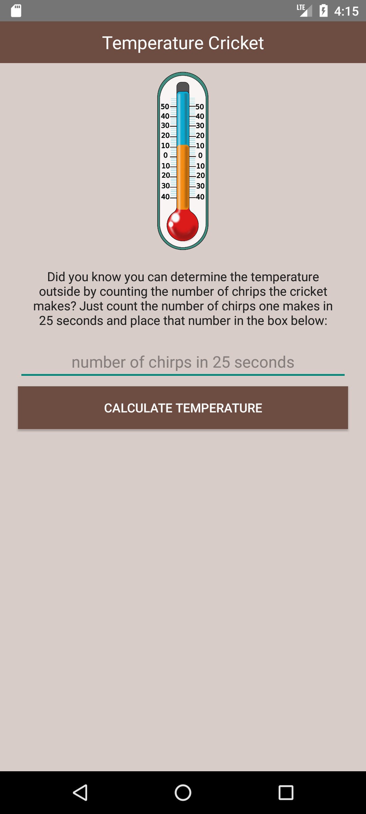

# 🦗 Cricket Chirps

**Cricket Chirps** is a fun and educational Android app that estimates the outdoor temperature based on the number of cricket chirps in 25 seconds. This phenomenon is based on **Dolbear’s Law**, which correlates chirp frequency to ambient temperature.

Built with **Kotlin** using **Android Studio**, this app features a simple UI and a straightforward formula to calculate temperature.

---

## 📱 Features

- 🔢 Input number of chirps in 25 seconds
- 🌡️ Calculate approximate outdoor temperature in Celsius
- 🧠 Learn a cool science fact with a clean UI

---

## 🧪 Formula Used

```
Temperature (°C) = (Number of chirps in 25 seconds / 3) + 4
```

This formula is a simplified version derived from Dolbear’s Law.

---

## 🛠️ Tech Stack

- **Kotlin** — Main programming language
- **Android Studio** — Development environment

---

## 🚀 Getting Started

1. Clone the repository:
   ```bash
   git clone https://github.com/fazcue/Cricket-Chirps.git
   ```
2. Open the project in **Android Studio**.
3. Let Gradle sync.
4. Run the app on an emulator or physical device.

---

## 📷 Screenshot



---

## 📄 License

This project is open-source and available under the [MIT License](LICENSE).

---

## 👨‍💻 Author

**Facundo Azcue** — [@fazcue](https://github.com/fazcue)
